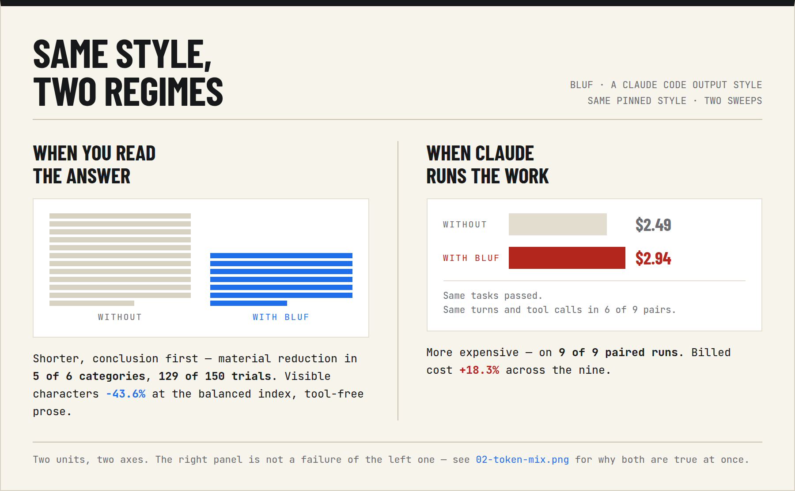

# BLUF

*Bottom Line Up Front.* A Claude Code output style that leads with the conclusion and cuts filler — measured, including what it costs.

**Shortens output in chat and prose; in agentic coding it's tighter to read but costs more to run.**

*Measured on opus-5, on a balanced JS/web-development benchmark — interim and model-judged. Not a real-usage guarantee.*



## When to use it

| Regime | Result |
| --- | --- |
| **Chat / prose** | output **~44% shorter** on a balanced JS/web benchmark (opus-5, one model, realistic padded-dense context). Cheaper *only* once caching amortizes the re-sent instructions across a multi-turn chat — a one-shot question can lose money ([break-even math](STORY.md)). |
| **Agentic coding** | output **~31% tighter** to read (`textChars` −31.5%) but **+18.3%** more expensive to run — the style's ~2,030-token instructions get re-sent on every turn, and in coding work that's most of the bill. |

A **lean, 65%-smaller variant** ([`output-styles/bluf-lean.md`](output-styles/bluf-lean.md)) projects to **~+6%** agentic, down from +18%. This is a **projection, not a measurement** — it has not been re-run through the sweep. Treat it as a lead, not a result. It scales the measured +18.3% by the variant's remaining instruction size and assumes the per-turn tax dominates linearly; the derivation and its assumptions are in [`STORY.md`](STORY.md).

## Before / after

Prompt: *"In git, what does `--no-ff` do on a merge?"* — claude-opus-5, tools disabled. **This pair is an illustrative capture taken separately, not a row from the results table.** Both responses are captured verbatim in [`evals/results/samples/`](evals/results/samples/); the exact commands are in [`samples/CAPTURE.md`](evals/results/samples/CAPTURE.md).

**Baseline — 586 output tokens** ([full text](evals/results/samples/git-no-ff.claude-opus-5.baseline.txt)), abridged:

> `--no-ff` forces git to create a merge commit even when a fast-forward would be possible.
>
> **Without it (default `--ff`):** if the target branch hasn't diverged, git just moves the branch pointer forward. No merge commit, and the fact that a branch ever existed disappears from the graph.
>
> […] ASCII commit-graph diagrams […]
>
> Related knobs:
> - `git config merge.ff false` — make `--no-ff` the default for all merges.
> - `git config --global pull.ff only` — refuse a pull that would need a merge.
> - `--ff-only` — the opposite: abort rather than create a merge commit.

**BLUF — 183 output tokens** ([full text](evals/results/samples/git-no-ff.claude-opus-5.0.2.0.txt)), in full:

> `--no-ff` forces git to create a merge commit even when the branch could fast-forward.
>
> Without it, if your current branch has no commits since the branch point, git just moves the pointer forward — no merge commit, and the branch's history looks like it was always linear. With `--no-ff`, you get an explicit merge commit with two parents, so the feature branch stays visible as a distinct set of commits.
>
> Common reasons to use it: keeping feature branches identifiable in the log, and making the whole feature revertable with a single `git revert -m 1 <merge-commit>`.

The cut is not free. The styled answer drops both commit-graph diagrams and the "related knobs" list. That is real content, not only padding. If you wanted those knobs, you now have to ask.

## Install

```bash
git clone https://github.com/carmelosantana/bluf.git
mkdir -p ~/.claude/output-styles && cp bluf/output-styles/bluf.md ~/.claude/output-styles/
```

Then run `/output-style BLUF` and `/clear`. An output style is read once at session start.

## Try it yourself (5 min)

Everything measured here is length, cost, model-judged correctness and completeness, and whether the code still worked. **None of it measures whether you liked the answer.** Only you can judge that.

```bash
claude -p 'in git, what does --no-ff do on a merge?' --settings '{"outputStyle":"Default"}'
claude -p 'in git, what does --no-ff do on a merge?' --settings '{"outputStyle":"BLUF"}'
```

Run the same question twice, once under each style, in a fresh session each time. That per-invocation `--settings` flag is how the whole benchmark selects conditions; for day-to-day use, `/output-style BLUF` instead.

## What the numbers say


**Agentic tax.** Output is 0.96% of billed tokens in the agentic sweep; the style adds roughly a 2,030-token instruction tax on every turn. Cutting the output sliver can't outrun a tax charged on the other 99%. Detail: [`RESULTS.md`](RESULTS.md), [`report-agentic-0.1.0.md`](evals/results/report-agentic-0.1.0.md).

**Quality is regime-dependent, not uniformly safe.** Phase 2b's pre-registered gate gives one point-estimate **PASS** (`conceptual-explain` — its per-prompt CIs are still wide) and a real **regression on `short-lookup`** — the style drops context a quick-lookup answer is judged on. Overall the gate is **WIN ×1 / CAUTION ×5**. Detail: [`RESULTS.md`](RESULTS.md).

## Honest limits

- **This is an interim, model-judged result.** The pre-registered human cross-check has not run yet; see [`RESULTS.md`](RESULTS.md) for what's outstanding.
- **Quality is regime-dependent, not uniformly safe** — one category passes on the point estimate, one regresses, the rest sit in a cautious middle (**WIN ×1 / CAUTION ×5**).
- **The agentic figures are one fixture set** — 3 fixtures, one model, 9 paired runs. Direction is consistent; no interval is claimed.
- **Every measured number here traces to a committed file** under [`evals/results/`](evals/results/). The one exception is the lean variant's projected ~+6%, labeled a projection, not a measurement.

## More

- [`STORY.md`](STORY.md) — the full narrative: the retraction, the follow-up that resolved it, the break-even math, and everything else that didn't fit here.
- [`RESULTS.md`](RESULTS.md) — the current, rigorous Phase 2b measurement.
- [`evals/results/`](evals/results/) — every raw row, committed.

## Credits

This style is assembled from prior art, and it exists because that prior art published token-savings claims without reproducible measurement:

- [toppa's ASD-STE100 gist](https://gist.github.com/toppa/bf7ff49d6fc44fd4fc3337248f8f2a7e) — the skill-to-output-style conversion pattern, the "Never apply to" carve-out, and "Length is not terseness".
- [danyuchn/asd-ste100-skill](https://github.com/danyuchn/asd-ste100-skill) — the structural sentence rules, modality preservation, and the slop scan.
- [ayghri/i-have-adhd](https://github.com/ayghri/i-have-adhd) — the structural rules, the precedence clause, and the pre-send check.
- [JuliusBrussee/caveman](https://github.com/JuliusBrussee/caveman) — the compression rules and the honest-numbers framing.

Full credit detail, including the four issue reports whose failure modes shaped these rules, is in [`STORY.md`](STORY.md#credits).

## License

[MIT](LICENSE)
