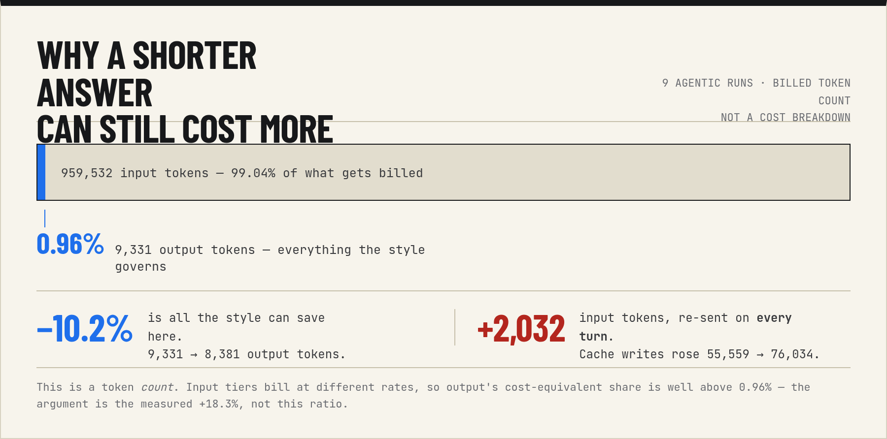

# The BLUF story, in full

This is the long version. [`README.md`](README.md) gives the headline numbers; this document
carries the narrative behind them — the reasoning, the false starts, the retraction, and the
follow-up that resolved it. For the rigorous interim numbers behind the Phase 2b resolution
below, see [`RESULTS.md`](RESULTS.md). All raw rows are committed under
[`evals/results/`](evals/results/).

## In plain terms

The measurement side of this project is genuinely fiddly, and the findings are easier to trust
once you can picture them. Four things, without the numbers:

**Why "fewer output tokens" doesn't mean "cheaper".** You pay for what you send as well as what
you get back. The style is a page of instructions that gets sent with *every* message, forever.
In a chat that's a fine trade: the reply shrinks by more than the instructions cost. In coding
work it isn't, because the replies are already short — most of what the model produces is tool
calls, and most of what you pay for is the file contents and command output being sent *to* it.
You end up paying the instruction tax on every turn to shorten the one part that was never the
expensive bit.

**Why measuring this is harder than it sounds.** You can't just run it once each way. The same
question asked twice gets answers of different lengths, so a single comparison mostly measures
luck. The fix is to repeat it many times and compare like with like — which is why this repo has
hundreds of recorded calls behind figures that could have been guessed at in ten minutes.

**Why we deleted a result we'd already published.** We first measured the style in a normal
setup, where the tool carries a lot of background context. That made the result specific to one
machine, so we re-ran it in a stripped-down "clean room" to make it portable. The number
collapsed. It turned out the clean room was the problem: with almost no context, one model
started giving very short answers *on its own*, about half the time. There was nothing left for
a brevity style to trim. The room we built to measure honestly had put the model somewhere no
real user ever is. We kept the retraction anyway, because the two runs differ in a second way we
can't undo — a fuller explanation is in [The Opus result](#the-opus-result-stated-plainly).

**Why "it saves a third" isn't the whole story.** Cutting a third off an answer is good if the
answer was padded and bad if it wasn't. So we wrote out, by hand, the shortest version of each
answer that would still fully answer the question, and compared. Without the style there's
plenty of slack. With it, the typical answer is barely above that line — and on one question,
about debugging with almost no evidence to go on, it drops below. Brevity rules can't tell the
difference between padding and the part where you explain how to find out.

**One thing this project cannot tell you:** whether *you* will like the answers. Everything here
measures length, cost, and whether code still worked. None of it measures whether the shorter
reply was the one you wanted. That judgement is yours, and it takes about five minutes — see
[Try it yourself](README.md#try-it-yourself).

## Before / after

Prompt: *"In git, what does `--no-ff` do on a merge?"* — claude-opus-5, tools disabled. **This pair is an illustrative capture taken separately, not a row from the results table.** The sweep's own `git-no-ff` opus row measured a median of 520 → 65 output tokens, in a different environment from this capture. Both responses below are captured verbatim in [`evals/results/samples/`](evals/results/samples/); the exact commands are in [`samples/CAPTURE.md`](evals/results/samples/CAPTURE.md).

**Baseline (`outputStyle: Default`) — 586 output tokens** ([full text](evals/results/samples/git-no-ff.claude-opus-5.baseline.txt)), abridged:

> `--no-ff` forces git to create a merge commit even when a fast-forward would be possible.
>
> **Without it (default `--ff`):** if the target branch hasn't diverged — i.e. your current HEAD is a direct ancestor of the branch you're merging — git just moves the branch pointer forward. No merge commit, and the fact that a branch ever existed disappears from the graph.
>
> ```
> before:  A---B---C main
>               \
>                D---E feature
>
> ff merge: A---B---C---D---E   main, feature
> ```
>
> […]
>
> Related knobs:
> - `git config merge.ff false` — make `--no-ff` the default for all merges.
> - `git config --global pull.ff only` — refuse a pull that would need a merge.
> - `--ff-only` — the opposite: abort rather than create a merge commit.
>
> […]

**BLUF — 183 output tokens** ([full text](evals/results/samples/git-no-ff.claude-opus-5.0.2.0.txt)), in full:

> `--no-ff` forces git to create a merge commit even when the branch could fast-forward.
>
> Without it, if your current branch has no commits since the branch point, git just moves the pointer forward — no merge commit, and the branch's history looks like it was always linear. With `--no-ff`, you get an explicit merge commit with two parents, so the feature branch stays visible as a distinct set of commits.
>
> Common reasons to use it: keeping feature branches identifiable in the log, and making the whole feature revertable with a single `git revert -m 1 <merge-commit>`.

The cut is not free. The styled answer drops both ASCII commit-graph diagrams and a "related knobs" list covering `merge.ff`, `pull.ff`, and `--ff-only`. That is real content, not only padding. If you wanted those knobs, you now have to ask.

## Measured results

Median output tokens per case across 5 trials, isolated environment. Source: [`report.md`](evals/results/report.md) and the `clean-*.jsonl` rows, which also carry the per-case delta ranges and the category-clustered summary.

| Case | Category | fable base | fable BLUF | opus base | opus BLUF |
| --- | --- | ---: | ---: | ---: | ---: |
| port-default | short-lookup | 113 | 24 | 245 | 5 |
| git-no-ff | short-lookup | 338 | 90 | 520 | 65 |
| to-sorted | short-lookup | 222 | 40 | 358 | 57 |
| health-endpoint | multi-step | 830 | 403 | 1,380 | 691 |
| actions-workflow | multi-step | 352 | 226 | 277 | 797 |
| cjs-to-esm | multi-step | 178 | 1,254 | 383 | 359 |
| 401-no-evidence | debug | 476 | 381 | 413 | 287 |
| ci-exit-1 | debug | 1,438 | 495 | 313 | 491 |
| scheduled-jobs | options | 921 | 558 | 674 | 1,131 |
| shared-types | options | 1,050 | 555 | 363 | 968 |
| security-headers | long-list | 1,459 | 925 | 2,580 | 1,634 |
| docker-cache-miss | long-list | 3,127 | 2,425 | 4,631 | 4,609 |
| **Sum of medians** | | **10,504** | **7,376** | **12,137** | **11,094** |

The bottom row sums the per-case medians. A sum of medians is not the median of sums, so it does not reproduce the headline: it gives −29.8% on fable and −8.6% on opus, against per-trial medians of −25.7% and −14.0%. The per-trial figures are the ones to quote, since they are computed per sweep and carry a range.

**The style loses on some rows, and on opus it loses on many.** Five of the twelve opus cases came out longer under BLUF at the median — `actions-workflow` (277 → 797), `ci-exit-1` (313 → 491), `scheduled-jobs` (674 → 1,131), `shared-types` (363 → 968), and `docker-cache-miss`, which is effectively flat. On fable, `cjs-to-esm` came out 178 → 1,254. Those rows are in the table and in every aggregate; none is excluded.

### Where the effect is not distinguishable from noise

**Twelve of the 24 per-case measurements have trial ranges crossing zero** — the style made the response shorter on one trial and longer on another:

| Model | Case | Δ output range |
| --- | --- | --- |
| fable-5 | actions-workflow | −609 to +94 |
| fable-5 | cjs-to-esm | −2,133 to +1,693 |
| fable-5 | 401-no-evidence | −624 to +439 |
| fable-5 | docker-cache-miss | −1,627 to +562 |
| opus-5 | 401-no-evidence | −285 to +218 |
| opus-5 | health-endpoint | −1,655 to +236 |
| opus-5 | security-headers | −1,535 to +167 |
| opus-5 | ci-exit-1 | −1,221 to +346 |
| opus-5 | shared-types | −1,267 to +873 |
| opus-5 | scheduled-jobs | −1,879 to +1,084 |
| opus-5 | cjs-to-esm | −104 to +2,458 |
| opus-5 | docker-cache-miss | −150 to +4,149 |

### The Opus result, stated plainly

The 12 prompts fall into 5 categories, and prompts within a category are correlated rather than independent draws. Collapsing to one value per category and bootstrapping over those five clusters gives an **indicative range** — not a confidence interval, because five clusters is far below where such methods are reliable:

| Model | Point estimate | Indicative range | Excludes zero? |
| --- | ---: | --- | --- |
| claude-fable-5 | +341 tokens saved | +183 to +484 | **Yes** |
| claude-opus-5 | −18 tokens saved | −181 to +161 | **No** |

**So the fable figure publishes and the opus figure does not.** On opus the point estimate is very slightly *negative* — BLUF produced marginally more output on average across categories — and the categories disagree in sign.

The cause is measurable and it is not the style. Answering the same 12 questions with **no style applied**, opus's total output per trial was 8,608 / 15,463 / 14,819 / 11,673 / 11,954 — an **80% spread**. Fable's was 10,880 / 12,467 / 10,914 / 9,665 / 11,797, a 29% spread. For comparison, opus in the previous, config-heavy environment varied **3.2%**. No effect of the size BLUF plausibly has can be resolved against a baseline moving 80%.

This is why the earlier −30.9% is retracted rather than merely superseded: it was measured in an environment carrying ~122,000 tokens of the operator's configuration, at three trials that were back-to-back repeats rather than independent sweeps. The isolated, properly-scheduled measurement does not reproduce it.

**The cause is now measured, and it is stranger than "noise".** A follow-up study — 70 further calls, written up in [`evals/analysis/README.md`](evals/analysis/README.md) and reproducible with `node evals/analysis/density.mjs` — found that in a sparse context `claude-opus-5` has **two discrete answer modes**, not a spread. It either answers briefly or writes the full treatment, with almost nothing in between:

```
clean   opus-5    303  355  378  394  547 | 2246 3005 3505 3675 3720
padded  opus-5                             2459 2608 2621 2792 2807 2982 3044 3072 3254 3283
```

Three findings follow, each from committed rows:

- **Context density gates the mode, and the content of that context is irrelevant.** Sparse opus-5 returned a short answer on 12 of 20 calls; dense opus-5 on **0 of 20** (Fisher exact, p = 4.5 × 10⁻⁵). 460,024 characters of *meaningless filler* suppressed the short mode exactly as well as the operator's real configuration did.
- **It is one model, not a trend.** In the same sparse environment, `claude-opus-4-8`, `claude-sonnet-5` and `claude-fable-5` produced **zero** short answers in thirty calls, at 7.3–10.8% variation. Sparse opus-5 sat at 68.6%.
- **It is not a harness fault.** No cache effect, no ordering effect, no trial-level state; every one of the 240 clean rows was a cold cache write and input varied by ~40 tokens across an entire file.

**What that means for the retraction, stated carefully.** It explains the collapse without rescuing the number. In a sparse room opus-5's *unstyled* answer is already 300–550 characters on half of calls — at or below what BLUF itself produces — so there is nothing left to cut and the measured effect goes to zero. In a dense room the unstyled baseline is reliably 2,261–4,263 characters and the style has real work to do. **The −30.9% was never wrong about a dense context; it was never a statement about a sparse one.**

It stays retracted regardless, for a reason the diagnosis cannot remove: every `full-*.jsonl` row is schedule version 1 and records no CLI version, while every `clean-*.jsonl` row is version 2 on CLI 2.1.222. The dense-versus-sparse comparison rests on exactly the cross-generation comparison this repo already says is not valid. Publishing it would mean trusting a confound we have written down twice.

**The uncomfortable implication is about the measurement, not the style.** A sparse "clean room" was adopted to remove the operator's machine from the result. For opus-5 it introduced a regime that real Claude Code sessions — which always carry substantial context — never occupy. The isolation that made the number portable also made it describe something nobody experiences.

### Phase 2b resolves the retraction

The paragraphs above stop at a diagnosis: the clean room explained *why* the opus number collapsed, but the isolated dense-versus-sparse comparison could not be published as a fix, because it crossed a schedule-version confound this repo already treats as invalid. **Phase 2b is the properly-scheduled re-measurement that diagnosis called for**, and it resolves the retraction rather than merely explaining it.

**Stated plainly: on opus, in realistic padded-dense context, BLUF prose genuinely compresses.** Across 30 prompts × 2 conditions × 5 trials (300 responses, ~120k input tokens per call — density chosen because that is the regime a real Claude Code session is always in), the balanced index is **−43.6% visible characters / −29.8% billed tokens**, with material reduction in **5 of 6 categories** and in **129 of 150 trials**. `multi-step` is the one exception, at a roughly-unchanged −9.1%. Full breakdown, per-category numbers, and the pre-registered uncertainty package are in [`RESULTS.md`](RESULTS.md); every row is committed under [`evals/results/`](evals/results/).

**The earlier clean-room, low-context regime is what had masked the effect and driven the retraction.** That is now the settled explanation, not a hypothesis: the two-discrete-modes finding above showed sparse opus-5 already answering briefly *on its own* about half the time, leaving nothing for a brevity style to cut. Phase 2b removes that confound by design — it runs dense, not sparse — and the effect that vanished in the clean room reappears at a similar magnitude to the original, retracted −30.9%. **The style does reduce opus prose length; the clean room had simply put the model in a regime no real user occupies**, and measuring it there was the error, not the style's absence of an effect.

**This does not un-retract the number the clean room measured, and it should not be read as one.** The −30.9% stays retracted for the reasons already given: it crossed a schedule-version boundary this project treats as invalid, and no re-run of that exact confound is being published now either. What Phase 2b establishes is the *claim* the retracted number gestured at — that BLUF shortens opus's prose in a context density real sessions actually have — on a new, independent, and much larger measurement (30 prompts against the original 12, with a pre-registered protocol, a blinded 3-judge quality panel, and a full bootstrap uncertainty package) that does not share that confound.

**Quality is regime-dependent, not uniformly safe, and Phase 2b says so plainly rather than rounding it off.** The length win does not come for free everywhere:

- **`short-lookup` is a consistent, category-wide quality regression.** All three judges score it negative. BLUF gives the load-bearing fact but drops the surrounding context a completeness rubric rewards — `port-default` answering "5173" without mentioning `server.port`/configurability is the representative case.
- **`conceptual-explain` is the one category with a clean PASS** under the pre-registered, deliberately conservative adoption gate (a category fails if *any* judge fails *any* prompt).
- **`long-list` is a cost regression, not a quality one:** +7.8% billed tokens even though visible characters still fall, because dense enumerations bill more per character than prose does.
- The other three categories (`multi-step`, `debug-partial-evidence`, `options`) land in the pre-registered gate's CAUTION band — not clean passes, not clean failures.

**This is an interim report, and the interim caveats bind here too.** The quality panel is model-judged (Codex, Sonnet, and a local Ollama model), not yet human-validated; the pre-registered mandatory operator cross-check has not run. Treat "Phase 2b resolves the retraction" as resolving the *length* question with confirmatory-scale evidence, and the *quality* question as regime-dependent and still open pending the human step. See [`RESULTS.md`](RESULTS.md) in full for the adoption-gate table, the per-prompt confirmed regressions, the judge-agreement statistics, and the uncertainty package this summary compresses.

### What it costs

**Output saved per turn.** The median of the per-trial means, from the 12-case sweep:

| Model | Output tokens saved |
| --- | ---: |
| claude-fable-5 | 216 |
| claude-opus-5 | *not quotable* |

Fable's figure is rounded for display; break-even below divides by the **unrounded** median,
215.9167. `perTrialMedianOutputSaved` returns the raw value for that reason.

**No opus figure is published here.** The same statistic computes to 139.5 on opus, but the
category-clustered range for opus spans zero, so that number describes noise as much as the
style. Quoting it would be the same mistake this project retracted once already. (Phase 2b, above,
resolves the retraction in a different, denser context; it does not license quoting this
particular sparse-context statistic, which is exactly the one the retraction was about.)

The statistic is the median of the per-trial means, matching the [Variance](#variance) section.
The pooled mean and the pooled median disagree with it, and with each other, by enough to
change a model's verdict — so `perTrialMedianOutputSaved` in `evals/lib/report.mjs` pins it
rather than leaving the choice to each call site, and a traceability test in
`evals/test/report.test.mjs` recomputes every figure in this section through the shipped
functions from the committed result files, so a re-measure that moves any of them fails a test
instead of leaving this document stale.

**Input added, split by how it bills.** From the committed amortization slice — two turns of
one session per condition, on `port-default` in the lean environment, on **claude-opus-5
only**. The committed run covered three conditions (18 calls), including the retired terse
arm — an earlier, more aggressive variant kept in [`archive/`](archive/) — whose rows are
preserved unchanged; a re-run of `npm run measure:amortization` today
covers two (12 calls):

| Variant | Turn | Cache write | Cache read | Total input added |
| --- | ---: | ---: | ---: | ---: |
| BLUF | 1 | **+2,030** | 0 | +2,030 |
| BLUF | 2+ | −263 | **+2,030** | +1,767 |

Every write measured 1-hour TTL; the 5-minute figure was 0 in all 18 rows. And every
measured turn 1 was **cold** — `inputCacheRead` 0 with a positive cache write in all 9
turn-1 rows — which is what makes the turn-1 row a cold-write figure at all;
`assertTurn1WasCold` in `evals/lib/runner.mjs` now enforces that precondition on any re-run.

The **Total input added** column is a raw token count, not a cost figure: the turn-2 row sums
a cache write and a cache read, which bill at different rates. Read it as a rate-limit and
context-budget number, like the total-tokens figure below; for anything involving money, use
the per-tier columns and the break-even table. The turn-2+ total is a **row sum of the two
median columns beside it**, not an independently computed median — the pinned statistic, the
median of the per-trial paired input totals, gives +1,774, 7 tokens
higher, because a sum of medians is not the median of sums.

**This split is the whole reason the earlier claim was wrong.** Uncached input, cache reads, and
cache writes bill at different rates, and 1-hour and 5-minute writes differ again. The harness
used to sum all of them into one `inputTokens` field before storing it, which makes a row
impossible to price at all. Only `evals/results/amortization-*.jsonl` carries the split.

**The −263 on turn 2 is a real saving, not noise — it is deterministic.** In all 9
(condition, trial) pairs, turn 2's cache write equals turn 1's output tokens plus exactly 16:
313→329, 112→128, and 268→284 on the baseline trials, 5→21 on every styled trial. Turn 1's
styled answer was 263 output tokens shorter at the median, so there was exactly that much less
to write into the prefix that turn 2 reads. An output saving is billed twice — once as output,
and again as the next turn's cache write.

**Break-even.** The output:input price ratio at which the input the style adds is exactly paid
for by the output it removes. Two figures, because the first turn of a session and every turn
after it are not the same trade. The steady-state column assumes each later turn arrives within
the cache TTL; a gap longer than the TTL re-pays the write. Every measured write carried the
1-hour TTL.

| Model | One-turn session | Steady state (turn 2+) |
| --- | ---: | ---: |
| claude-fable-5 | 18.80× | 0.94× |

**These ratios got worse, and the reason is the smaller measured saving.** At three trials in
the config-heavy environment the same table read 10.58× and 0.53×. The input overhead did not
move — it is the output saving that fell, from 384 tokens per turn to 216. One caveat on the
mixture: the input half comes from the amortization slice, which is **opus-measured in the lean
environment**, while the output half is fable-measured in the isolated one. The overhead is
near-identical across both models and all three environments (2,030 / 2,032 / 2,033), which is
what makes the mixture defensible, but it is a mixture.

Above the ratio the style saves money; below it, it costs money. So a **single-turn** session is
a loss unless output costs you more than 18.8× input — which no current price list comes near —
while **every turn after the first** is a win unless output costs you *less* than 0.94× of
input. On Anthropic's published price list — the same source as the cache multipliers below —
every model prices output above input, so the steady-state case still wins; if you buy through
another provider, that comparison is yours to check.

**The margin is now thin where it used to be comfortable.** At 0.94× the steady-state case
clears break-even by a smaller factor than the measurement's own spread. Treat "saves money from
turn 2" as directionally supported, not as a precise multiple.

The steady-state column is deliberately **conservative: it ignores the −263 write saving.**
Counting that saving makes the steady-state input delta negative, meaning the style would be
cheaper on the input side alone before any output saving is counted. The table does not claim
that, because the write saving scales with the previous turn's output saving and was measured on
one case.

Converting a cache-read token to a base-input token requires a **price multiplier this project
did not measure.** The table above uses Anthropic's published structure — cache reads at 0.1× base
input, 1-hour cache writes at 2×, per [Anthropic's prompt-caching
documentation](https://platform.claude.com/docs/en/build-with-claude/prompt-caching). Those
multipliers are published pricing, not a measurement of ours; the measurement is the token
counts, and the multipliers are the reader's to check. **No price is attached to any measured
result in this repository** — the only currency figure in the repo is the warning in
[Reproducing](#reproducing) about what a rerun costs. That is deliberate: a ratio built from
measured tokens cannot go stale, and a dollar figure we never measured would be exactly the
unverifiable claim this project exists to object to.

**How long the first turn takes to pay back.** At an output:input ratio of 5×, and on **fable
only**, the first turn's net loss is recovered after roughly **3.4 further turns**. No opus
figure is quoted here: the opus output saving is not distinguishable from zero, so a payback
period derived from it would be a number built on one this document declines to publish.

*An earlier draft of this paragraph said 0.47 to 1.25 turns, "soonest on opus", and claimed both
models were ahead by the end of their third turn. Those figures came from the superseded 3-trial
run; the break-even table beside them was updated at the time and this paragraph was not. It was
wrong by roughly 3×, in the direction that flattered the style, and it ranked the models the wrong
way round — opus now saves less, not more. Caught in the final review before publication.*

**Total tokens, which is not a cost figure.** Pooled median total-token change per turn — the
median over all 60 per-case paired differences in each condition, not the per-trial statistic
the output-savings figures use: **+1,693 (fable)** and **+1,856 (opus)**, from the same
`clean-*.jsonl` rows as every other current figure. The direction is the same under either
statistic. (An earlier draft printed +1,673 and +1,583 here, which were the 3-trial
full-environment medians over 36 pairs, left unlabelled under headings describing the 5-trial
clean run.) Read this as a **rate-limit
and context-budget** number, because that is what raw token counts govern. It is **not** a cost
proxy: it adds four differently-priced quantities as though they were interchangeable. Use the
break-even table above for anything involving money.

The total figures are medians rather than sums because of a cold-cache artifact, where cache
creation is billed in full at a cache boundary. It persists in the clean run: across the 240
turns backing the figures above, exactly 1 carries it — 11,324 input tokens against a 4,797
median. (The superseded full-environment run measured 1 such turn in 144, at 245,184 against a
123,631 median; the absolute numbers are far larger there because those rows also carry the
operator's machine configuration.) Interleaving the conditions was expected to reduce this and
did not.
Medians ignore it; sums do not.

### Variance

5 independent trials per case. A trial is a whole sweep of all 12 cases in a reshuffled order,
with the condition rotation keyed on case and trial — **schedule version 2**. That distinction
matters for reading any range here: under version 1, used for the superseded 0.2.0 figures, a
case's repetitions ran back to back with the rotation keyed on the case alone, so those ranges
measured the spread of quick repeats rather than of independent sweeps. See the Schedule
versions section of [`evals/results/README.md`](evals/results/README.md).

| Model | Per-trial reduction | Median | Trials negative |
| --- | --- | ---: | ---: |
| claude-fable-5 | −20.6% / −23.8% / −25.7% / −42.0% / −49.3% | **−25.7%** | 5 of 5 |
| claude-opus-5 | −29.5% / −18.4% / −14.0% / **+22.4%** / **+78.0%** | −14.0% | 3 of 5 |

**Read the opus row as the finding, not as a footnote.** Two of five sweeps measured the style
making responses *longer* in aggregate, one of them by 78%. That is not a small perturbation of
a −30.9% effect; it is a different picture entirely.

**The baseline is what moves.** Total unstyled output per trial, same prompts, same model:

| Model | Baseline output per trial | Spread |
| --- | --- | ---: |
| claude-fable-5 | 10,880 / 12,467 / 10,914 / 9,665 / 11,797 | 29% |
| claude-opus-5 | 8,608 / 15,463 / 14,819 / 11,673 / 11,954 | **80%** |

For comparison, the same opus baseline in the previous config-heavy environment varied **3.2%**
across its trials. Removing ~122,000 tokens of ambient configuration from the context appears to
destabilise how much Opus writes — by a factor of twenty-five. **This project has not explained
that, and does not claim to.** It is the single most interesting thing the redesign surfaced, and
it is an open question rather than a result.

**The effect size depends on how verbose the baseline currently is, and that moves.** The archived
v1 run of the same 12 cases measured the opus baseline at 15,914 output tokens summed across the
cases ([`full-claude-opus-5-baseline-v1.jsonl`](evals/results/full-claude-opus-5-baseline-v1.jsonl)).
A chattier baseline gives the style more to cut, so a reduction percentage is a statement about
the model's current habits as much as about these rules. Treat these percentages as measured
against the models as they behaved in August 2026, not as constants.

## What happens in agentic work

**The style makes agentic runs more expensive, and it did so in every pair measured.**
Billed cost rose **+18.3%** in total and **+17.7%** at the median across 9 paired runs,
positive in **9 of 9**, range **+10.5% to +33.4%**. Source:
[`report-agentic-0.1.0.md`](evals/results/report-agentic-0.1.0.md); every figure here is
recomputed from the committed rows by `evals/test/agentic-results.test.mjs`, which makes no
API call.

This does not contradict the prose result above and does not retract it. The **−25.7%** is
a tool-free, single-turn prose figure, measured where output *is* the product and no
context is re-sent. Agentic work is a different regime, and the same mechanism has the
opposite sign there. One style, two regimes, both measured.



**What was measured.** 18 paid calls — 3 fixture projects × 3 trials × 2 conditions, on
`claude-fable-5`, in the same isolated `clean` environment as the prose sweep. The fixtures
are an exploration task (`explain-cache`), a failing-test fix (`failing-test`), and a
multi-file rename (`rename-option`). Each fixture is copied fresh for every call, so no run
inherits another's edits, and success is decided by running the fixture's own test command
— exit code 0, nothing else. Total spend **$5.4322**.

**Task success first,** because efficiency figures mean nothing across arms that finished
different amounts of work. **12 of 12** scored runs passed their fixture's test, 6 per arm,
and all **6 of 6** exploration runs completed without error. No arm completed fewer tasks.

**Per metric.** 9 pairs, paired as (fixture, trial). Deltas are styled minus baseline;
negative favours the style.

| Metric | Median delta | Median % | Direction |
| --- | ---: | ---: | --- |
| `numTurns` | 0 | 0.0% | 6/9 identical, 3/9 +1, 0/9 negative — inside noise |
| `toolCalls` | 0 | 0.0% | 6/9 identical, 3/9 +1, 0/9 negative — inside noise |
| `totalCostUsd` | +$0.042 | **+17.7%** | **9/9 positive**, +10.5% to +33.4% — outside noise |
| `outputTokens` | −84 | −8.5% | 7/9 negative — real but small |
| `textChars` | −253 | −39.6% | 8/9 negative — real and large |

Totals across the 9 runs per arm: cost **$2.488 → $2.944 (+18.3%)**; output tokens 9,331 →
8,381 (−10.2%); input tokens 959,532 → 1,074,192 (+11.9%); turns 58 → 61; tool calls 49 →
52.

**The mechanism is a per-turn input tax, not changed behaviour.** Three observations pin
it down:

- **6 of 9 pairs have identical turn counts *and* identical tool-call counts, and all 6
  still cost more.** The work was the same; the bill was not.
- The three `explain-cache` pairs isolate it exactly — both arms took 3 turns and made 2
  tool calls in all three trials, so the whole input difference is the style itself. Per
  turn that difference is **+2,031 / +2,023 / +2,046** input tokens, against the style's
  committed 2,028–2,038 overhead band — **one of the three sits inside that band and the
  other two land within 8 tokens of its edges**, which is the honest way to put it.
- Across all 9 pairs the median input added per baseline turn is **+1,662 tokens**, and
  cache writes — the most expensive input tier — rose **55,559 → 76,034 (+37%)**.

**The output saving cannot pay for that.** The decisive evidence is the measured bill itself,
which rose 18.3%. The reason is visible in the token mix: output is **0.96%** of billed tokens
in these runs — 9,331 output against 959,532 input in the baseline arm. Weighting each token by
what it bills raises output's share well above that raw figure, so the raw 0.96% is an
illustration of the imbalance rather than the argument (see [Known
limitations](#known-limitations) on why the two shares differ); the argument is the +18.3%.

**The style does exactly what it was written to do, which is why it cannot help here.**
`textChars` fell **−31.5%** overall while `toolUseChars` moved **+3.0%**; prose fell from
**56.2%** to **46.0%** of generated characters. The style compresses the assistant's
talking and leaves its tool calls alone. In prose work talking is the whole product. In
agentic work it is a sliver of the bill.

### The prediction that held

Before these calls ran, the plan for the sweep predicted that if the prose sweep's baseline
instability comes from sparse context letting response length wander, then dense agentic
context should constrain it — so agentic output should be markedly more stable. Measured:
whole-trial baseline output sums were **3,047 / 3,060 / 3,224, a 5.8% spread**, against
**29%** for fable and **80%** for opus in the prose sweep. The pattern holds inside the
sweep too: the densest fixture (`rename-option`) spread 4.4%, `failing-test` 10.2%, and the
most conversation-like fixture (`explain-cache`) 31.2%.

**The pre-registration is not provable from this repo.** The plan is a local working
document that is deliberately not committed, so the repo attests the measured spreads but
cannot show the prediction predated the data. You have the operator's word for the
ordering, not a commit hash.

### Limits of the agentic measurement

- **18 calls, 3 fixtures, one model (`claude-fable-5`), 3 trials.** Nothing generalises
  beyond that without more spend.
- **9 pairs supports no interval, and none is claimed.** Direction consistency — cost up in
  9 of 9 — is the honest statistic at this scale, which is why it is the one quoted.
- **The exploration fixture is unscored.** Its "success" is only that the run completed
  without error; nothing judges the content of its explanations.
- **`total_cost_usd` is CLI-reported** — an API-list-price equivalent, not an observed
  bill. Each row also records an auxiliary `claude-haiku-4-5` call billed alongside the main
  model, in both arms.
- **The runs used the `clean` environment**, so absolute input totals will differ on a
  configured machine. The per-turn style tax is additive and should not.
- **12/12 task success shows no adequacy penalty *at this scale*; it does not show there is
  none.** That question gets its own section below.

## Does it make anything faster?

**No. The style has no measurable effect on wall-clock time.** 6 of 12 pairs faster under the
style, 6 slower; the median difference is **0.27 seconds** on calls averaging about 18 seconds, and
the total across all pairs moved **+0.8%**. That is not a slowdown and it is not a speed-up — it is
nothing.

This figure came free, and how it was recovered is worth a sentence. **No result row in this
repository records a duration** — the schema was designed around billing and wall-clock never made
it in. But the agentic sweeps committed their raw transcripts, and the CLI's result event carries
`duration_ms`. So the 24 committed transcripts answered the question without buying a call.
`evals/test/timing.test.mjs` recomputes every number here from them.

Two limits. It covers the **agentic sweeps only** — the 260-call prose sweep stored no transcripts,
so its timing is gone and cannot be recovered without paying again. And every timed call is
`claude-fable-5`; there is no opus timing anywhere in the repo.

Why the null is unsurprising in hindsight: the style cuts output tokens, and generation time scales
with output — but in agentic work output is a sliver of the total, and most of the wall-clock is
spent on tool execution and re-sending context, neither of which the style touches. The same
mechanism that makes the cost go up keeps the clock flat.

## Is what remains enough?

**Three instruments, three honest results: one did not discriminate, one found nothing but
can only find what it has patterns for, and one says the styled output has roughly no slack
left over a hand-written sufficiency floor.** None of them establishes that the style
produces insufficient answers, and none of them rules it out.

### Hidden edge-case tests — the instrument did not discriminate

**Both arms went 3/3 on the visible task and 3/3 on a hidden suite they were never told
about.** Source: [`report-adequacy-0.1.0.md`](evals/results/report-adequacy-0.1.0.md), 6
paid calls — 1 fixture × 3 trials × 2 conditions on `claude-fable-5`, total spend
**$2.4627**.

That is a ceiling, not a finding. Neither arm ever failed, so the sweep produced no
evidence that this measure can separate the arms in practice. Six runs on one fixture is an
existence probe; no rate or percentage comes out of it, and none is claimed.

**It is not vacuous, though.** The fixture plants a bug in `ordinal(n)` and ships two
suites: a visible one the prompt refers to, and a hidden one injected only at scoring time.
A committed `naive.patch` fixes the bug by last digit only — it passes the visible suite and
fails the hidden one on the teens exception and on negatives. That split is verified by a
free contract test and re-verified for real by a pre-spend gate before any money moves. A
failure was possible and did not occur.

**Why the ceiling was plausible:** the edge cases the hidden suite tests are documented in
the docstring of the very file the prompt names, and all six transcripts show the model
reading it. So this fixture measures whether the model read and honoured a written
contract, which is one kind of adequacy, not all of it.

The same 6 calls also replicate the agentic cost finding on a fixture the main sweep never
ran: cost **+16.1%**, up in **3 of 3** pairs, with `textChars` −35.8% and `toolUseChars`
+3.0% — the same shape as the 18-call sweep.

### Over-compression scan — zero, and weak

**Zero placeholder-style elisions, in either arm, anywhere in the committed corpus** — 12
prose samples and 24 agentic transcripts. Source:
[`report-compression-0.1.0.md`](evals/results/report-compression-0.1.0.md). This scan makes
no API call; it runs over evidence already paid for.

It looks for four patterns — `comment-ellipsis`, `truncation-marker`,
`unchanged-placeholder`, `lazy-todo` — the shapes a response takes when it looks complete
while standing content off behind a placeholder. Each pattern ships a positive example that
must fire and a negative that must not; the test also pins the corpus size and plants a
known elision that the scanner must catch.

**State the weakness plainly: a pattern detector finds only what it has patterns for.** A
response that simply stopped short — no placeholder, no marker, just less — is invisible to
it, and that is the likelier failure mode for a style whose whole instruction is to be
brief. A clean scan says the style did not visibly announce that it left something out. It
does not say the answers were complete.

### The minimal-sufficient floor — the sharpest result


**The styled arm's median case sits +4.2% over a hand-written minimal-sufficient answer;
the unstyled arm sits +73.3% over it.** Source:
[`report-floor-0.1.0.md`](evals/results/report-floor-0.1.0.md), recomputed from the same
committed rows as the −25.7%. No API call was made to produce it.

**Who wrote the floors matters, so it is disclosed first: the twelve floors were written by
an AI assistant, in the same session that produced the analysis. They were not written by
an independent human and were not reviewed by one.** The author of a yardstick that
flatters an adjacent project has an obvious incentive, and nothing here neutralises it. Two
things partly offset it: each floor states its own requirements in a header, including
explicit "does not require" clauses, and all twelve are committed — so a reader who thinks
a floor is wrong can edit it and rerun the numbers. Read every figure below as "excess over
one particular reader's opinion of sufficiency".

The unit is **characters**, on both sides, measured rather than estimated. It is
deliberately not tokens: billed output includes thinking, a floor has no thinking, and
chars-per-token across the 120 rows ranges 0.25 to 3.26. So these figures are **not in the
same unit as the published −25.7%**.

| | baseline | BLUF |
| --- | ---: | ---: |
| Median case excess over floor | +73.3% | **+4.2%** |
| Cases whose median is below floor | 2 of 12 | **6 of 12** |
| Individual trials below floor | 9 of 60 | **26 of 60** |

**The honest cut is one case, not six.** Six styled cases sit below floor by median, but
the floors' own precision, calibrated against five verbatim samples that satisfied their
floors' stated requirements at excesses down to −16.5%, is about **±17%**. Four of the six
— `scheduled-jobs` (−2.4%), `docker-cache-miss` (−5.8%), `shared-types` (−6.6%) and
`actions-workflow` (−9.2%) — are inside that precision and are evidence of nothing. On
`401-no-evidence` the styled arm is the **longer** of the two — 486 characters against the
baseline's 232 — so both arms are under that floor and the style moved the answer *toward*
sufficiency, not away from it.

**That leaves `ci-exit-1` as the only case where the style crosses the floor on its own:**
the unstyled answer cleared it at **+29.7%** and the styled answer did not, at **−62.5%**,
on 5 of 5 trials. It is a `debug-partial-evidence` case, and that is the part worth
attention — those are the prompts where a complete answer is a diagnostic path rather than
a fact, and a brevity rule has no way to tell a diagnostic path from padding.

**What the floor says about the published −25.7%.** On the identical 60 pairs, the
per-trial output-token reduction medians **−25.7%** and the per-trial response-character
reduction medians **−38.6%**. The style cuts prose harder than it cuts billed output,
because billed output includes thinking the style does not govern — so anyone quoting
−25.7% as the amount of *answer* removed is understating it. The published figure is not
too large; if anything it is too small. What the floor adds is a denominator: on this
corpus the remaining margin is thin rather than generous.

## The 0.1.0 regression on Opus

Version 0.1.0 of these rules cut fable-5 output by 22.7% and **inflated opus-5 output by 32.2%**. The full run is preserved in [`evals/results/report-0.1.0.md`](evals/results/report-0.1.0.md). This is the strongest argument for measuring across models at all: the same prompt made one model shorter and another longer.

**That run is not methodologically comparable to the current one** — it was a single trial per case with each condition run as a contiguous block. The regression is far enough outside the measured spread to survive the difference, but the two reports should not be diffed row by row. See [`evals/results/README.md`](evals/results/README.md).

What caused it, per the case data:

- The "Length is not terseness" block only ever forbade cutting. It never forbade adding, which Opus read as licence to expand.
- The summary became additive rather than substitutive. Opus wrote conclusion bullets **and** a full headed body saying the same thing.
- Nothing bounded unrequested context. `port-default` went from 5 to 66 output tokens purely from facts nobody asked for.
- "Never truncate" read as a mandate to enumerate every possibility.

Four rule changes in 0.2.0 fixed it:

1. "Length is not terseness" now states it protects needed content and does not invite content the question did not ask for.
2. A new contract rule: "The summary replaces the body. It does not introduce it." Saying anything twice is forbidden, and the pre-send check now deletes any section that restates a bullet.
3. A new rule: "Answer what was asked, and stop."
4. "Never truncate" is scoped: relevant means it bears on the question asked. It stops you dropping what the reader needs; it does not ask you to enumerate.

### The regression fix, illustrated

Prompt: *"What port does the Vite dev server use by default?"* — case `port-default`, on claude-opus-5. This compares 0.1.0 against 0.2.0; it shows the regression being fixed, not the style's value over no style. Both responses are captured verbatim in [`evals/results/samples/`](evals/results/samples/).

| 0.1.0 (retracted) | 0.2.0 (current) |
| --- | --- |
| 5173.<br><br>Vite serves on `http://localhost:5173` by default. If that port is taken, Vite increments to the next free port (5174, 5175, …). Override it with `--port 3000` on the CLI or `server.port` in `vite.config.js`. | 5173. |

Nobody asked about port collisions or overrides. In the current run, the unstyled opus baseline answers this prompt in a median of 245 output tokens and BLUF answers it in 5 — the same 245 the results table above prints. (An earlier draft said 140, which was the median of the superseded full-environment rows.)

## Known limitations

- Output styles do not apply to subagents. A subagent runs its own system prompt. A fork is the exception, since it inherits the parent's.
- An output style takes effect only after `/clear` or a new session. Claude Code reads it once at session start.
- The style shrinks output tokens and adds input tokens on every turn — but the measurement shows the addition bills as a cache write on the first turn only; every turn after re-reads it as a cache read of the same size instead of re-paying the write. Whether that nets out to a saving is a price-ratio question: see the break-even table in [What it costs](#what-it-costs).
- Measured on two models with five trials per case, and the result held on only one of them. Your workload is not these 12 prompts. Phase 2b (above) extends this to 30 prompts on opus alone, in a denser context, and the length result held there.
- Measured against models as they behaved in August 2026. Baselines drift, and the effect size drifts with them.
- **The headline figures describe tool-free, single-turn prose.** All 12 prompts are conversational questions and the harness passes `--tools ''`. Nothing reads a file, edits code, or runs a command, so the headline does not describe agentic coding work — the thing Claude Code mostly does. Agentic work is now measured separately, and there the style **costs 18% more**: see [What happens in agentic work](#what-happens-in-agentic-work). It is a small sweep — 18 calls, 3 fixtures, one model — but it is no longer a gap.
- **In agentic work a large output reduction is a small cost reduction.** Generated output is roughly a tenth of cost-equivalent tokens once tool results, file contents, and re-sent context are counted; a design-time measurement on this machine put it at 7.5–12.4%, consistent with a published 2,908-run study at 10.4%. Cutting a third of a tenth is not cutting a third.
- **A separate, smaller figure — the raw token share — comes from the agentic sweep: output was 0.96% of billed tokens** (9,331 output against 959,532 input in the baseline arm). **This is not a correction of the bullet above and does not replace it.** They measure different things: a *cost-equivalent* share weights each token by what it bills, and since cache reads bill at a fraction of uncached input while output bills at a multiple of it, the cost-equivalent share is legitimately much larger than the raw share. Quote the 7.5–12.4% figure for money and the 0.96% figure for rate limits and context budget.
- **The `$48–54` figure in [Reproducing](#reproducing) is an API-list-price equivalent, not an observed bill.** The harness passes no API key and authenticates exactly as the operator's CLI does, so on a subscription that spend is quota, not cash. The practical risk of a large sweep is exhausting a rate limit, not an invoice.
- **More trials cannot narrow this result; more prompts can.** Decomposing the paired delta on opus gives a between-prompt SD of **427** and a run-to-run SD of **849**. The second shrinks as 1/√n; the first does not shrink at all. With twelve prompts the 95% interval on the mean effect cannot get below roughly **±25% of a baseline response** however many trials are bought. Going from 5 trials to 40 costs eight times the calls and buys seven points; going from 12 prompts to 60 at 5 trials costs five times the calls and buys twenty-two. The 5-trial design here was the more expensive of the two available moves. Full table in [`evals/analysis/README.md`](evals/analysis/README.md).
- **Per-message `output_tokens` in Claude Code transcripts are unreliable.** A design-time probe summed 189 output tokens across assistant messages for a call whose result event reported 5,065 — a 27× undercount. This harness reads the result event, which is why its figures do not inherit that error; tools built on transcript parsing may.
- **Phase 2b's quality panel is model-judged, not human-validated, and is itself an interim report.** See [`RESULTS.md`](RESULTS.md) §7 for the pending pre-registered human steps and the protocol deviations already on record.

## Reproducing

```bash
npm test
```

```bash
TRIALS=5 npm run measure
```

```bash
npm run measure:agentic
```

```bash
npm run measure:amortization
```

`npm test` runs 590 tests with zero dependencies on Node 22+.

**`TRIALS=5 npm run measure` makes 260 live API calls and costs real money** — 12 cases × 2 conditions × 5 trials × 2 models in the clean environment (240 calls), plus 2 overhead cases × 2 conditions × 5 trials in the lean environment (20). The only measured cost figure is for a different design and does not transfer: the last full run — 3 trials, full environment, still carrying a third condition at 234 calls — cost roughly $48–54. The sweep is not part of `npm test` and nothing runs it by accident. It refuses to start while any file it would write is tracked by git, so committed evidence has to be preserved under a versioned name (or sacrificed by name via an environment variable the refusal message documents) before it rewrites `evals/results/`. Omit `TRIALS` for a single-trial run of 52 calls, which is cheaper and correspondingly less trustworthy.

**`npm run measure:agentic` makes live API calls and spends real money.** It runs the fixture
projects under both conditions and is scoped by `FIXTURES=` and `TRIALS=`, so you choose how
much it costs. The two runs recorded here cost **$5.4322** for 18 calls (3 fixtures × 3 trials
× 2 conditions) and **$2.4627** for 6 calls (the `hidden-edges` fixture, 3 trials × 2
conditions) — both CLI-reported `total_cost_usd`, which is an API-list-price equivalent rather
than an observed bill. It refuses to start unless every fixture it would pay for goes green
under its own oracle first, checked for real in a temp copy rather than trusted from the last
`npm test`; for the `hidden-edges` fixture it also re-verifies that the naive patch still
passes the visible suite and fails the hidden one, since a rotted split would measure nothing.
It also refuses to overwrite committed evidence: if any file it would write — a result row or a
raw transcript — is tracked by git, it aborts rather than replacing it.

**`npm run measure:amortization` makes 12 live API calls** — 2 conditions × 3 trials × 2 turns, on claude-opus-5 — and also spends real money, though far less than the sweep. It regenerates the input half of the break-even table: the per-tier cache write/read splits in `evals/results/amortization-*.jsonl`. It, too, runs only when you invoke it.

**`npm run preflight` makes 2 live API calls** — one baseline, one styled, on claude-opus-5 — and verifies the output style actually reached the model before a sweep spends anything on it. It, too, runs only when you invoke it.

**Install the style before measuring.** The sweep selects each condition by style name. If `bluf.md` is not in `~/.claude/output-styles/`, the styled condition silently resolves to the default and you measure Default against Default. Run the install step above first. The prompt set is pinned by SHA-256 and the sweep refuses to run if it has been edited.

**Reproducing Phase 2b** is a separate, opus-only, larger sweep; its own reproduction commands and source files are listed at the end of [`RESULTS.md`](RESULTS.md).

## Corrections

**The cost claim, corrected before first release.** Earlier drafts of this README stated that
total tokens rise and therefore the style *"does not buy a smaller bill."* The token count was
measured. The conclusion did not follow from it: the harness stored input tokens as a single
sum of three classes that bill at different rates, so no row in the original dataset could be
priced at all. The claim was replaced with the break-even table above, and the harness now
stores the three tiers separately.

A second error travelled with it. The break-even figures first circulated for internal review
were computed from **means** of per-turn output deltas, while every headline percentage in this
document uses **medians**. At an output:input ratio of 5×, the mean figures say all four
combinations save money and the median figures say fable does not. A verdict that flips on the
choice of statistic is not a verdict, so the statistic is now pinned in code.

**The Opus reduction, retracted before first release.** Earlier drafts published **−30.9%** on
claude-opus-5, from three trials in an environment carrying ~122,000 tokens of the operator's
machine configuration, with "trials" that were back-to-back repeats rather than independent
sweeps. Re-measured at five independent trials in an isolated environment, the effect on opus is
**not distinguishable from zero**: the category-clustered range spans it, two of five trials came
out positive, and 8 of 12 cases straddle zero. The figure is retracted rather than superseded,
because the conditions that produced it were not ones a reader could reproduce. The 3-trial rows
and their report are preserved unchanged at
[`report-0.2.0.md`](evals/results/report-0.2.0.md) and the `full-*.jsonl` files. What replaced it
is not a smaller number but the absence of one, plus the measured reason: the unstyled opus
baseline varies 80% between sweeps in that environment, against 3.2% in the old one.

**This retraction stays on the record. It is not silently dropped, and it is now resolved.**
Phase 2b (see [Phase 2b resolves the retraction](#phase-2b-resolves-the-retraction) above and
[`RESULTS.md`](RESULTS.md) in full) re-measured opus prose reduction in the padded-dense context
a real Claude Code session actually runs in, at confirmatory scale — 30 prompts, 300 responses,
a pre-registered protocol — and found a genuine, material reduction: **−43.6% chars / −29.8%
tokens**, in 5 of 6 categories and 129 of 150 trials. That result does not retroactively validate
the retracted −30.9% figure, which crossed a schedule-version boundary this project still treats
as invalid; it is a new, independently-clean measurement of the same underlying claim. The
retraction paragraph above is preserved unedited, exactly as the project's own policy of not
quietly deleting a published number requires — this paragraph is the annotation, not a
replacement.

**The shape of the saving claim, corrected before first release.** Earlier drafts of this
README described the style's effect only for tool-free prose, and disclosed in Known
limitations that agentic work was unmeasured. Every figure was true and the gap was named.
But the shape of the claim — a headline output saving, with the unmeasured case in a limits
list — invited a reader to assume the saving generalised to the work Claude Code mostly does.
It does not. Measured, the style **cost 18% more** in agentic runs, in 9 of 9 pairs, and the
reason is structural rather than incidental: the style's own text is re-sent as input on every
turn. Nothing published was false. The claim was nonetheless shaped so that the most natural
reading of it was wrong, which is why this is a correction and not an addition.

Nothing was published under the old claim; this section is not a public correction. It is here
because a project whose premise is that the prior art published unverifiable numbers cannot
quietly delete its own and present the result as having been right all along. Same reason the
retracted 0.1.0 result archive is kept byte for byte.

## Credits

This style is assembled from prior art, and it exists because that prior art published token-savings claims without reproducible measurement. The sources contributed real ideas:

- [toppa's ASD-STE100 gist](https://gist.github.com/toppa/bf7ff49d6fc44fd4fc3337248f8f2a7e) — the skill-to-output-style conversion pattern, the "Never apply to" carve-out, and "Length is not terseness".
- [danyuchn/asd-ste100-skill](https://github.com/danyuchn/asd-ste100-skill) — the structural sentence rules, modality preservation, and the slop scan.
- [ayghri/i-have-adhd](https://github.com/ayghri/i-have-adhd) — the structural rules, the precedence clause, and the pre-send check.
- [JuliusBrussee/caveman](https://github.com/JuliusBrussee/caveman) — the compression rules and the honest-numbers framing.

Four issue reporters found the failure modes this style's rules correct:

- [i-have-adhd#99](https://github.com/ayghri/i-have-adhd/issues/99) — a rule that demands a cause pressures the model to invent one. Hence the Errors rule: never supply a plausible cause in place of a confirmed one. The rule reduced this failure mode; it did not eliminate it. Our own shipped sample for it ([`401-no-evidence.claude-opus-5.0.2.0.txt`](evals/results/samples/401-no-evidence.claude-opus-5.0.2.0.txt)) correctly lists four candidate causes without picking one, yet its opening line asserts the request was rejected "before any handler logic ran" — an attribution a 401 status alone does not establish.
- [i-have-adhd#96](https://github.com/ayghri/i-have-adhd/issues/96), reported by `nbali` — "cap lists at 5" drops relevant findings. Hence: group and rank, never truncate.
- [i-have-adhd#43](https://github.com/ayghri/i-have-adhd/issues/43), reported by `kuhlsnu` — style rules collide with the harness system prompt. Hence the precedence clause: the harness outranks the style.
- [i-have-adhd#112](https://github.com/ayghri/i-have-adhd/issues/112) — over-adherence stalls tool use into "want me to?" loops. Hence: do the work instead of asking.
